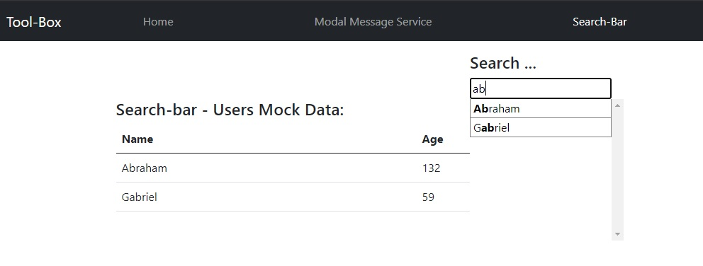

# Angular Tool-Box

## Demo: [Tool-box](https://LaurentLoi.github.io/Tool-Box/)

- ### [Modal messages module](https://github.com/LaurentLoi/Tool-Box/tree/main/src/app/modules/modal-messages)

    A simple messages modal module to display info, success and error messages, or confirm messages that wait for user answer.
    
    

- ### [Search-bar module](https://github.com/LaurentLoi/Tool-Box/tree/main/src/app/modules/search-bar)

    A basic search-bar tool "ready to go".

    
