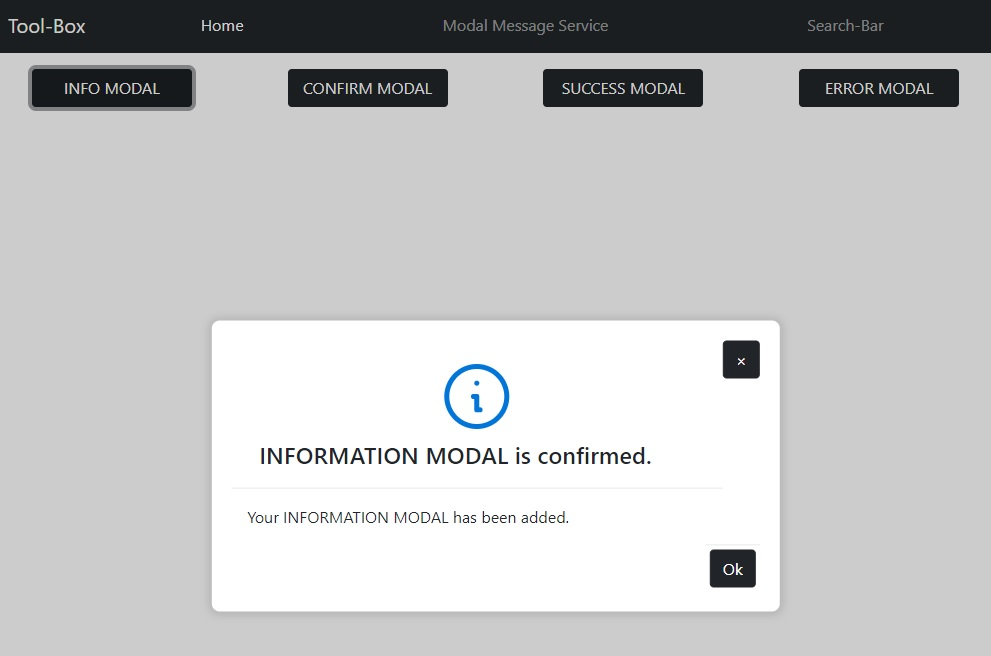

# Angular Tool-Box

- ## [Modal messages module](https://github.com/LaurentLoi/Tool-Box/tree/main/src/app/modules/modal-messages)

    A simple messages modal module to display info, success and error messages, or confirm message that wait for user answer.
    
